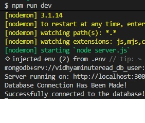

#### MongoDB Connection Test Project

This project is a simple Node.js and Express backend connected to MongoDB using Mongoose. The server accepts HTTP requests from Postman and stores book data inside a MongoDB database. Middleware is used to parse incoming JSON and form data, while Mongoose handles schema creation and database operations. The application demonstrates how Express routes, MongoDB connections, and CRUD-style create operations work together in a backend API. Nodemon is used during development to automatically restart the server whenever changes are made to the code.

#### Screenshot

